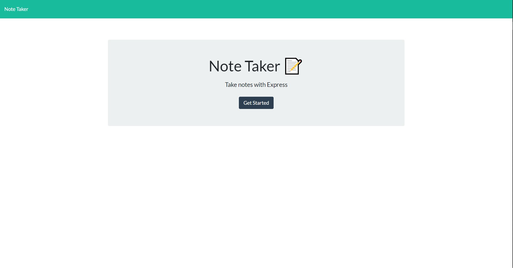

# Note-Taker

## Description
This is a note taking web application. With this note taking application you can
write notes and save them for later.

## Code Description 
This web application uses a express.js api that gets, posts, and deletes notes. 
How this application works is, it uses fetch api calls from the front-end to call
the api to get, post or delete data from a dataset that is stored in a json file. the
API has routes set up for each function on the web app. If you would like to
look around in the code and see how it all works there will be a guide on how to
install and test features below the page link and screenshots.

## Table of contents 
* [link](#link)
* [Usage](#usage)
* [Screenshots](#screenshots)
* [Installation](#installation)
* [Tests](#test)
* [Questions](#questions)

## Link
Here is the link to the fully working web app. Please enjoy!
* [Note Taker](https://note-taker-mc.herokuapp.com/)

## Usage
How to use Note Taker. When you are presented with the landing page click
the get started button. After that click in the greyed out text fields labeled,
Note Title and Note Text. Once you have filled in the title and text you want
then there will be a save button located at the top right of the screen. click
that and boom your note is now saved.

## Screenshots

 

## Installation
Installation for this project if you want to play around with the code  

Make sure you have Node.js installed on your device that you will be running
this on  

then after that all you need to do is run: 
<pre>npm install</pre>
in your CLI and all of the node packages will be installed  
to then run the api/server you need to run:
<pre>npm start</pre>
in your CLI then click the link given and the web page should be on your localhost

## Tests
### How to test this project if changes are made. 
Test for this file are in the /__tests__ file. The tests were made using the npm
package jest. To run these test do <pre> node run test</pre> In your ClI to
complete the tests for this project if anything is changed in those files.

## Questions

If you have any further questions please contact me by email or with my GitHub Username listed below

* Email : mjbc53@gmail.com

* GitHub [mjbc53](https://github.com/mjbc53) 

